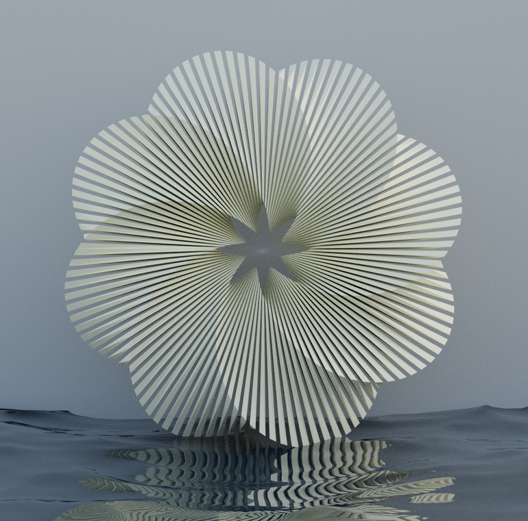

### Composition Practice

I wanted to practice my eye for colors, compositon, and movement in this series. I mostly wanted to explore simple geometric shapes with nature. This is also my first time creating in 3D without relying on a tutorial. 

<!-- ## Images -->

  
  
  

### Water Sculptures

I used a few tutorials for these. Learned about the ocean modifier & how to use the math function add-on for the different wild torus and flower shapes. 

  
  
  

I hope to spend more time modeling and rendering in my free time after graduation and in between job hunts :) 

