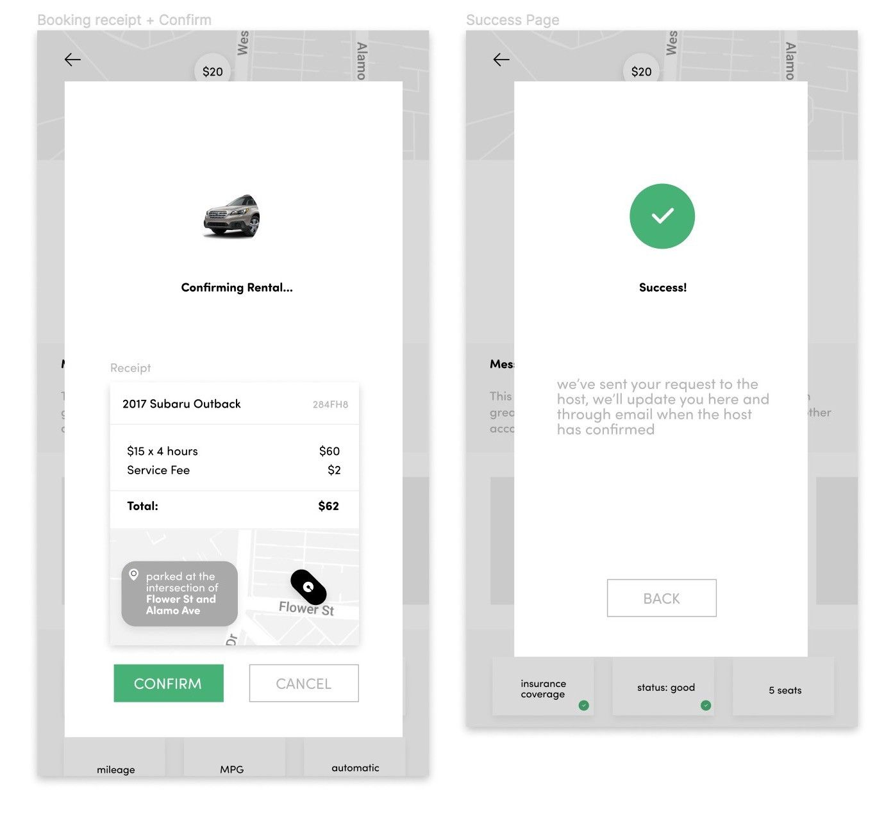

### Overview

Timeline: October 2019 (2 weeks)

A car-sharing platform that aims to optimize car usage for occupied cars & build trust between hosts and renters. Done for the KPCB Challenge. 

### Process 

  

#### 1 — Deciding Problem Space 

Upon looking at the participating portfolio companies listed on the site, I was frankly a little overwhelmed by the vast number of directions that this challenge could go in. Which company’s product should I pick to redesign for the challenge? I was particularly drawn to the mission of Modern Health, but I couldn’t get access to their app as a student, and so there wasn’t any opportunity there for taking a closer look at their interface for a redesign. Then I looked at Airbnb, incepted a few ideas — such as Airbnb Gallery and a rewards program, but ultimately chose not to go along with either of them when I realized that it’d be a little difficult to find artists and frequent Airbnb users to do interviews on.

Then I turned to Uber. It’s a company at the forefront of the rising gig economy, transforming not only the way people move around but also the way people work. Since I have an  interest in the future of work, I thought that focusing on Uber would allow me to learn more about the company’s role in changing the labor industry.

Uber Rent. According to an article published in 2018, it’s a program that had partnered up with Getaround —a startup that lets users find and instantly book vehicles from private car owners, to provide users with the option of renting a car in the Uber app itself. Apparently, the feature was only available in some selected cities from April 2018 to November 2018. Why was Uber Rent eventually taken off the app after only after its brief, short-lived appearance? I couldn’t find much information online, but I knew I wanted to tackle the challenge of reimagining this forgotten feature.

#### 2 — Defining the Problem 

How do we optimize car usage for unoccupied cars in parking lots? This was the initial, proposed question that I had prior to conducting any interviews. After learning more about the underlying uncertainties that the potential users were skeptical about, the high-level problem statement was reframed to:

>How do we build trust between the renter and the host?

#### 3 — Conducting User Research  

I interviewed three people in a span of three days in order to better understand some of the concerns that these potential users may have. For the process, I audio recorded them and transcribed the audio afterward. While transcribing, I paid special attention to quotes that had either intense positive or negative emotions to them. Some of the notable quotes from the interviews were:

“Going from here to LA would kind of be disastrous, and my stress level would go up”
“I think I would be, to let a stranger use my car, because I’m assuming there’s some sort of financial gain that I can possibly make, and I would let my friends borrow my car and so, I feel comfortable doing that sort of thing.”
"But if I got money for it, totally, why not”

Overall, I found that all of them are concerned with the credibility and trustworthiness of the renter and host. They all had wanted more information about the respective party before either renting out their car for a stranger to use or using a stranger’s car.

#### 4 — Wireframes

  

#### 5 — Mocking up Solutions

Overall, I found that all of them are concerned with the credibility and trustworthiness of the renter and host. They all had wanted more information about the respective party before either renting out their car for a stranger to use or using a stranger’s car.

#### Renter's view

In this flow, the screen first prompts the renter to enter their location that they’d like to find nearby cars from. They can enter the radius in which they want to walk to in order to retrieve the car, as well as the size/type of the car they’re interested in filtering in. After pressing “find”, the screen will give way to a map of available cars in the neighborhood. The hourly price for each car is also listed as a bubble for the up top for the user’s convenience in picking out which one they’d like to go for.

  

After they’ve selected a car that they’re interested in renting, they can then get a more detailed view of the car model and view its relevant information, including insurance coverage, the status of maintenance, MPG, radius in which they can drive the car in, etc. Then, they can proceed to view the time availability of the car through a calendar. After tapping on an available date, the time slots in which the car is free for rent then pop up. If they want to specify the times in which they’d like to use the car, they can do that by manually putting in the proposed pick up time & return time.

Then, the calculated cost is displayed, along with an option to book the car for a day instead of by the hour. Below that, there is a text area for the renter to enter their purpose of the trip and the destination they’re planning on driving the vehicle to. All of these sequential steps are to enhance the trust between the two stakeholders and to ensure adequate communication occurs before the exchange happens.

  

Below is the page for confirming the rental request. The success page tells the renter that they still need to wait for the host’s response to receive the final confirmation for their request.

  

The renter has the option of clicking on the host’s profile to view more information about the host, which includes area they’re located in, overall rating, a bio & fun fact, as well as a section for written reviews from previous renters.

  

#### Host's view

Here, after the host logs in, it takes them to a dashboard that lists the car that they’ve put up for rental. If there are multiple cars that the host has listed for rental, then there would be more cards when they scroll to the right of the screen. On the card, they can easily see whether or not the car is currently occupied by a renter. They can also track the location of the car so that they feel safer about its whereabouts. As they scroll down the dashboard, a list of past rentals is displayed. From here, they can also tap on each individual’s profile of the past renters if they want to contact them for any reason about their previous usage of the car.

When there is a new request for rental, it’d immediately pop up after opening the app. The host has the option of accepting or denying the renter. The reason why there is an option for “deny” is that I want to make sure the host feels comfortable enough to rent the car out to a specific person without feeling a loss of control over who uses their car. Moreover, the host can also tap to view more info about the prospective renter, so that they feel safe about who’ll be using their car.

  

### Recap 

✔︎ Decided on problem space
✔︎ Defined the problem
✔︎ Conducted user research
✔︎ Drew information architecture and wireframes
✔︎ Mocked up solutions for renter's and host's view

### Reflection

This is my first time completing a solo side project from start to finish, so I learned a lot about how to lead and guide myself through different stages of the design process. I learned about what parts of product design I enjoy the most: wireframing and mapping out the user flow.